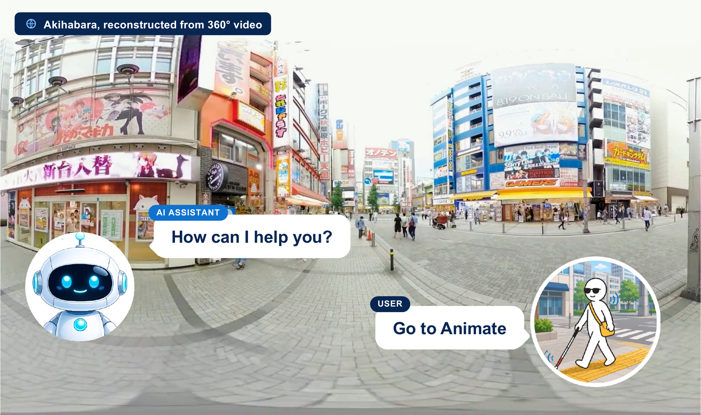

# 360CityArena: A Realistic Virtual Urban Navigation Benchmark for Embodied Agents [ECCV 2026]

<p align="center">
  <strong>Kenta Watanabe</strong>&emsp;
  <a href="https://atsumiyai.github.io/"><strong>Atsuyuki Miyai</strong></a>&emsp;
  <strong>Mizuki Takenawa</strong>&emsp;
  <a href="https://scholar.google.co.jp/citations?user=CJRhhi0AAAAJ&amp;hl=en"><strong>Kiyoharu Aizawa</strong></a>&emsp;
  <a href="https://scholar.google.com/citations?user=rE9iY5MAAAAJ&amp;hl=en"><strong>Toshihiko Yamasaki</strong></a>
</p>

<p align="center"><em>The University of Tokyo</em></p>

<p align="center">
  <a href="https://360mm-team.github.io/360CityArena/"><strong>🌐 Project Page</strong></a>
</p>

<p align="center">
  
</p>

360CityArena is a Unity-based embodied navigation and visual reasoning benchmark for multimodal large language models. It couples a 360-degree city-view Unity environment with a Python runner that sends camera and map observations to MLLM APIs, executes task sequences, and records reproducible result summaries.

This repository does not include previous experiment results. New runs write public summaries under `outputs/<run_id>/`.

## Benchmark Contents

The public benchmark release contains 175 tasks: 25 tasks in each of seven
families. Each task is defined by a CSV row under `benchmark/tasks/` and, when
needed, a task reference image under `benchmark/assets/`.

- `localization.csv`: infer the initial grid cell from exploration and a grid map.
- `landmark_search_language.csv`: navigate to a named landmark.
- `landmark_search_image.csv`: navigate to a landmark shown in a reference image.
- `counting.csv`: count specified objects within a constrained area.
- `map_navigation.csv`: navigate from a start marker to a goal marker on a map.
- `language_guided_navigation.csv`: follow natural-language directions.
- `relational_spatial_reasoning.csv`: identify a nearby landmark from a spatial relation.

Release inventories are recorded in `benchmark/manifests/`. See
`docs/task_taxonomy.md` for task definitions and `benchmark/tasks/README.md` for
the public task catalog.

## Repository Layout

- `benchmark/`: public benchmark data.
- `benchmark/tasks/`: CSV task definitions.
- `benchmark/assets/`: reference images used by benchmark tasks.
- `benchmark/manifests/`: release manifests for task and asset inventory.
- `unity/`: Unity project and environment.
- `python/`: Python package, runner, and model clients.
- `scripts/`: convenience run scripts.
- `docs/`: benchmark protocol, schema, and model documentation.
- `examples/configs/`: environment variable examples for model providers.

## Setup

1. Install Unity 6.5 (`6000.5.0f1`, the version recorded in
   `unity/ProjectSettings/ProjectVersion.txt`) and open `unity/` from Unity Hub.
2. Install `uv` for Python dependency management.
3. Install Python dependencies:

```bash
cd python
uv sync
```

4. Configure API keys by exporting environment variables or by adapting the examples under `examples/configs/`. Do not commit real secrets.

## Running

Run one task:

```bash
cd python
OPENAI_API_KEY=... MODEL_NAME=gpt-5 ./models/openai.sh --task-id 5001
```

Run all tasks:

```bash
cd python
OPENAI_API_KEY=... MODEL_NAME=gpt-5 \
LLM_VALIDATION_MODEL=gpt-5 LLM_VALIDATION_PROVIDER=openai \
./models/openai.sh --all
```

Direct runner invocation:

```bash
cd python
PYTHONPATH=src uv run python -m cityarena run \
  --all \
  --model gpt-5 \
  --provider openai \
  --validation-model gpt-5 \
  --validation-provider openai \
  --experiment-id openai-gpt-5-public-run \
  --output-root ../outputs
```

Package entrypoint:

```bash
cd python
PYTHONPATH=src uv run python -m cityarena run --task-id 5001 --model gpt-5 --provider openai
```

Task IDs can be selected individually, as comma-separated lists, ranges, task
types, or `--all`.

By default, the runner saves only:

- `outputs/<run_id>/results.csv`
- `outputs/<run_id>/run_metadata.json`

When a run exits, the runner also prints a benchmark summary derived from
`results.csv`: the official mean `evaluation_score`, per-task-type scores, and
a task-by-task result table.

`--experiment-id` is a label recorded in metadata. Unless `--run-id` is set explicitly, the runner creates a timestamped `run_id` to avoid mixing results from separate executions. If you intentionally want to append to an existing `results.csv`, pass `--append-results`.

Use `--save-debug-artifacts` only when you need per-step traces, prompt context, images, or log files for debugging. Debug artifacts can be large and may include raw model inputs.

## Evaluation Protocol

The official score is the mean of `evaluation_score` in
`outputs/<run_id>/results.csv`. Object Count uses mean relative accuracy (MRA)
over the ten thresholds from 0.50 through 0.95; all other task families use a
binary 0/1 score. A task receives a nonzero score only when the model explicitly
ends with `ANSWER`. `scored_success` and `is_correct` remain available as
binary diagnostics.

Public task runs use a 50-action limit per task. Runs may also stop with
`STAGNATION` when the agent repeats the same action without changing position
for 20 consecutive requests. `Map Navigation` additionally stops with
`AWAY_FROM_GOAL` after five consecutive movement steps away from the goal.

Most task families are validated with exact, grid-coordinate, MRA, or
distance-threshold checks. `Relational Spatial Reasoning` uses an LLM judge for
fuzzy answer matching, so runs that include this family require
`LLM_VALIDATION_MODEL` and `LLM_VALIDATION_PROVIDER` or the corresponding
`--validation-model` and `--validation-provider` arguments. See
`docs/evaluation_protocol.md` and `docs/results_schema.md` for details.

## Model Wrappers

Wrapper scripts are provided under `python/models/`:

- `openai.sh`: OpenAI
- `claude.sh`: Anthropic
- `gemini.sh`: Google Gemini
- `qwen2.5-vl.sh`: OpenAI-compatible local/server endpoint
- `internvl3.5.sh`: OpenAI-compatible local/server endpoint
- `azure-openai.sh`: Azure OpenAI

All wrappers read secrets and model names from environment variables. `MODEL_NAME` is required for provider wrappers. Direct runner use requires both `--model` and `--provider` unless `MODEL_NAME`/`LLM_MODEL` and `PROVIDER`/`LLM_PROVIDER` are set. The Azure wrapper requires `AZURE_OPENAI_API_KEY`, `AZURE_OPENAI_ENDPOINT`, `AZURE_OPENAI_DEPLOYMENT`, and `AZURE_OPENAI_API_VERSION` unless equivalent `LLM_*` variables are set.

## Results

Existing experiment results, logs, prompt HTML/JSON, PDFs, and analysis outputs are intentionally not included. Runtime outputs are ignored by Git. See `docs/results_schema.md` for the result file format.

## Licenses

Code is licensed under Apache-2.0. Dataset and benchmark assets are distributed under CC BY-NC 4.0; see `DATA_LICENSE` and `NOTICE`.

Map-derived assets include OpenStreetMap data; cite OpenStreetMap contributors
and follow the Open Database License terms for derived map data.

## Citation

### 360CityArena

```bibtex
@inproceedings{watanabe2026360cityarena,
  title     = {360CityArena: A Realistic Virtual Urban Navigation Benchmark for Embodied Agents},
  author    = {Watanabe, Kenta and Miyai, Atsuyuki and Takenawa, Mizuki and Aizawa, Kiyoharu and Yamasaki, Toshihiko},
  booktitle = {Proceedings of the European Conference on Computer Vision (ECCV)},
  year      = {2026}
}
```

### Underlying Virtual Environment

```bibtex
@article{takenawa2026building,
  author  = {Mizuki Takenawa and Naoki Sugimoto and Leslie W{\"o}hler
             and Satoshi Ikehata and Kiyoharu Aizawa},
  title   = {Building and Evaluating a Realistic Virtual World for
             Large Scale Urban Exploration from 360° Videos},
  journal = {Multimedia Tools and Applications},
  volume  = {85},
  number  = {2},
  pages   = {149},
  year    = {2026}
}
```
